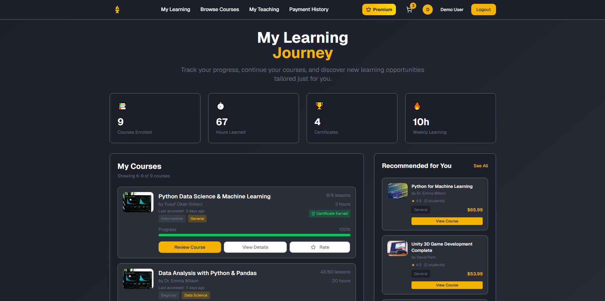

# ⚙️ Xenoforge Marketplace — Modern Learning Platform

<br>

[](https://xenoforge-marketplace.vercel.app)
[](../../issues/new?labels=bug)
[](../../issues/new?labels=enhancement)

<br>

## 📌 Project Overview

**Xenoforge Marketplace** is a modern e-learning and course marketplace platform that connects instructors and learners.  
Users can create and sell their own courses, explore content from others, and securely purchase them using integrated real payment systems.

<br>

## ✨ Features

### 👥 User Experience & Profiles
- User profiles with enrolled and purchased courses  
- Track learning progress, view course history  
- Clean, intuitive navigation across learning and instructor areas
- Smart, performant search to find other instructors’ courses quickly  

---

### 🛠️ Course Creation & Management
- Instructors can create, edit, and publish courses  
- Upload thumbnails, titles, pricing, and detailed descriptions  
- Manage lessons, categories, and course visibility  
- Draft and publish modes for better workflow

---

### 💳 Secure Payments (Stripe Integration)
- Real payment system with **Stripe Checkout**  
- Handles one-time and subscription-based payments  
- Automatic payment confirmation & webhook event tracking  
- Refund and cancellation support

---

### 🎨 User Interface
- Responsive and mobile-first UI
- Clean and accessible design
- Smooth animations and consistent component design

---

### 🔒 Security
- Strong password encryption with bcrypt  
- Token-based authentication and session handling  
- Prisma query protection & input validation  
- CSRF and XSS protection enabled

---

### 🚀 Performance & Optimization
- SSR and CSR with Next.js  
- Lazy loading, code splitting, and image optimization  
- Optimistic UI updates and real-time synchronization  
- Built-in caching for faster page loads

---

### 🔧 Development & Maintenance
- TypeScript, ESLint, and Prettier for clean code  
- Prisma ORM for structured database access  
- pnpm and Turbopack for efficient builds  
- Modular architecture with reusable components  
- AI-assisted development on **Cursor** platform

---

## 🖼️ Screenshots

Shown below in order:  
**1. Landing** · **2. My Learning** · **3. Courses**<br>
**4. My Teaching** · **5. Payment History** · **6. Cart**<br>
**7. Checkout** · **8. Stripe Checkout** · **9. All Courses**<br>

<p align="center">
  
  
  
</p>

<p align="center">
  
  
  
</p>

<p align="center">
  
  
  
</p>

<br>

## 🧰 Tech Stack

<p>
  
  
  

## 📥 Installation

### Prerequisites
Before you begin, make sure you have:
- **Node.js 18+**
- **PostgreSQL** installed and running
- **Stripe API keys** (for payment integration)
- **SMTP email service** credentials (for transactional emails)

### Setup
```bash
# Clone the repository
git clone [repository-url]
cd xenoforge-marketplace

# Install dependencies
pnpm install

# Copy environment variables file and configure it
cp .env.example .env

# Apply database migrations
pnpm db:migrate

# Start the development server
pnpm dev
```

<br>


## 📜 License

[](LICENSE)

This project is licensed under the terms described in the [LICENSE](./LICENSE) file.

---

© 2025 Yusuf Okan Sirkeci — [Hereetria](https://github.com/Hereetria)
